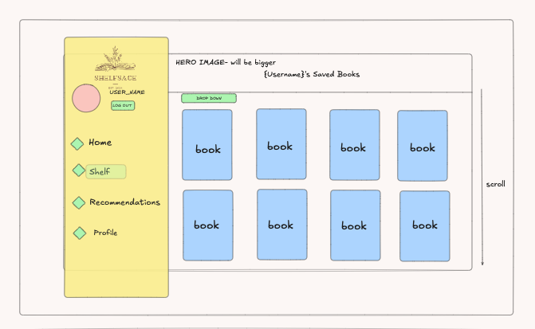

# ShelfSage

## Overview

ShelfSage is a personalized book recommendation web app that allows users to discover books based on their reading preferences or what they have on their 'shelf'. The user will be able to create a profile, add books to their 'shelf', and receive book recommendations similar to Netflix. I will be using AI to recommend books based on the user's interactions and saved books.

### Problem Space

There is an overwhelming amount of books in the world and finding one that matches an individual's tastes can be difficult. Readers rely on reviews online or browsing bookstores; or often invest money and time in books that are not satisfying. My web app simplifies this by offering personalized recommendations, eliminating the need for excess research on their next read.

### User Profile

ShelfSage is designed for avid readers who want to keep track of their growing piles of books. Users will be able to:
 - Search for books, authors, genres
 - Add books to their personal shelf
 - Remove books from their personal shelf
 - Receive personal book recommendations
 - View details about books
 - Manage their profile and account settings

### Features
Book detail modal: Clicking on a book opens a modal that includes a synopsis, genre, and option to add/remove the book from the user's shelf. This is implemented throughout the web app.
1. Homepage:
 - Search functionality: A search bar at the top of the page will allow the user to find books based on title, author, or genre from the Goodreads API.
 - Popular book section: List of popular books displayed with a horizontal scroll.
2. User's Shelf Page:
 - Bookshelf view: Users can see the books they've saved, displayed as cards.
3. Recommendation page: 
 - Recommendations on a horizontal scroll, separated into lists based on genre, authors, and keywords.
4. Profile Page:
 - Basic user management
 - Changing username and password
 - User can upload/change profile image
 - A delete profile button

## Implementation

### Tech Stack

Frontend:
 - React
 - Axios
 - SCSS

Backend:
- Node.js with Express (for managing API requests and user authentication).
- Google Recommendation AI

Database: 
- mySQL (for user data and saved books)

Libraries/Tools:
- Goodreads API
- React Router
- dotenv

Potential Limitations:
 - Goodreads API may have a rate limit.
 - Google recommendation Ai might need to be trained on book data.

### APIs

GoodReads API: This api will fetch book information when users search for books and view details.
https://www.goodreads.com/api

Google Recomendation AI: Will suggest books based on the user's shelf and app interactions.
npm install @google-cloud/recommendation-engine

### Sitemap
Homepage (logged out):
 - Offers a login or register option
 - No other pages are shown

Homepage (logged in):
 - Includes a search engine and popular books displayed in a horizontal scroll. 
 - Clicking on a book will open a modal with more details and the ability to add the book to user's shelf.

User's Shelf Page:
 - Displays the user's saved books. 
 - Clicking on a book will open a modal with more details and the ability to remove the book from user's shelf.

Recommendation Page:
 - Shows recommended books based on the user's preferences.
 - Books are separated into lists, with horizontal scroll, based off of genre, author, and keywords (Metadata).
 - Clicking on a book will open a modal with more details and the ability to add the book to user's shelf.

Profile Page:
 - Allows the user to upload and update their profile image
 - Allows the user to update their username and password
 - Has a button to delete the account

### Mockups
Subject to change.

Mobile view Homepage - logged out

Mobile view General Homepage - logged in

Tablet/Desktop view Homepage - Logged in

Tablet/Desktop view Shelf Page - logged in

Tablet/Desktop view Recommendation Page - logged in

Tablet/Desktop view Profile Page - logged in

Main Logo and Colour Palette

### Data
Metadata: Used to categorize and suggest similar books.
 - Title, Author, Genre, Publication Date, Description, ISBN (International Standard Book Number), Reviews, and Cover Image
 - Keywords, Series Information, Age Recommendations

Books: 
 - Book details fetched from the GoodReads API

User Shelf: 
 - Book data stored in the database will reference the unique book ID from the API. 
 - User actions, adding books to their shelf, will be tracked to enhance recommendations.

Recommendations: 
 - Google Recommendation AI analyzes the book Metadata and user interactions to provide personalized recommendations.

Relationships:
 - Users -> Books: Users can add multiple books to their shelf (one to many relationship between users and books).
 - Books -> Recommendations: Based on Metadata from books the user has interacted with (one to many relationship).

### Endpoints

#### Goodreads API Endpoints:
1. GET book.show_by_isbn:
 - Fetch book details using the ISBN
 - For searching and adding books to the user’s shelf
 - Parameters: isbn
 - Title, author, genre, ratings, reviews, etc.

2. GET search.books:
 - Find books by title, author, or ISBN
 - Implementing the search bar on the home page

#### Custom Endpoints:
1. POST /auth/login:
 - Log a user into the app
 - Requests { username, password }
 - Response: User ID, session token

2. POST /auth/signup:
 - Creates a new user account
 - Requests { username, email, password }
 - Response: User ID, session token

3. GET /books/shelf/:userId:
 - Get a user's saved books
 - Parameters: userID
 - Response: List of saved books with book IDs

4. POST /books/shelf/add:
 - Adds a book to the user's shelf
 - Requests { userId, bookId }
 - Response: Confirmation of the book being added

5. DELETE /books/shelf/remove:
 - Removes a book to the user's shelf
 - Requests { userId, bookId }
 - Response: Confirmation of the book being removed

6. GET /recommendations/:userId:
 - Get book recommendation for a user
 - Parameters: userId
 - Response: List of book recommendations

## Roadmap

#### Day 1-2: Initial Setup:
 - Set up the React app, backend (Node/Express), and basic routing.
 - Integrate the API endpoints.
 - Implement user authntication using JWT.

#### Day 3-4: Frontend Pages:
 - Build up the styling for each of the pages.
 - User shelf page: Implement the user's saved books. Fethcing from GET /books/shelf/:userId: route.
 - Create the modal component for the book details.

#### Day 5-6: Recommendations and API:
 - Build the /recommendations/:userId endpoint using basic metadata and integrate it into the frontend.
 - Add the functionality to the profile page. Let the users update the profile username, upload a profile image, and delete their account.

#### Day 9-11: Testing and Refinement:
 - Polish the UI and test for responsiveness.
 - Handle any errors/bugs.

#### Day 12: Deployment:
 - Deploy the app with Netlify, Render, Heroku or AWS.

---

## Future Implementations
The primary goal for this web app is to ensure that the core functionality is operational and that the application is polished enough for deployment. However, if time constraints arise, prioritizing a working local version of the website is preferable to a broken deployed version. As such, deployment may be considered a post-project task.

Additionally, the initial recommendation engine will focus on using Metadata and user interactions to suggest books. In the future, I plan to integrate a user similarity-based recommendation system. This enhancement will require a larger user base and additional time to develop and refine the recommendation algorithms.
